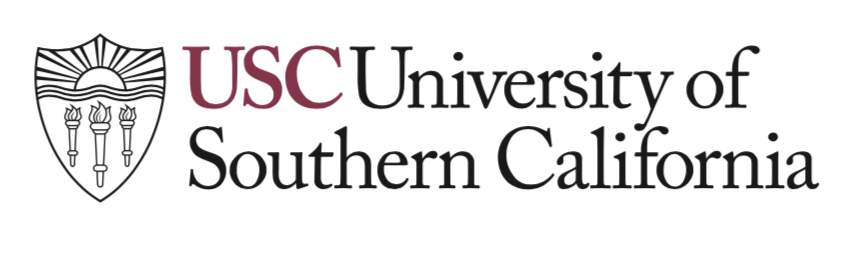

# Keyword Driven Exploration of U.S. Hospitals and Hotels

 

## Project description

The project aims to import four hospital datasets into SQL databases and one hotel review dataset into Firebase. A web interface will be developed for users to select the desired dataset, search based on user preferences, and explore with primary and foreign key relations.

## Datasets
The following datasets are provided by Centers for Medicare & Medicaid Services (CMS) and are accessible via Socrata Open Data API (SODA).

1. [Complications and Deaths - Hospital](https://data.medicare.gov/Hospital-Compare/Complications-and-Deaths-Hospital/ynj2-r877) (23MB) - includes scoring and national comparison of complications and deaths of U.S. hospitals.
2. [Timely and Effective Care - Hospital](https://data.medicare.gov/Hospital-Compare/Timely-and-Effective-Care-Hospital/yv7e-xc69) (21MB) - includes scoring of care in various departments of U.S. hospitals.
3. [Healthcare Associated Infections - Hospital](https://data.medicare.gov/Hospital-Compare/Healthcare-Associated-Infections-Hospital/77hc-ibv8) (43 MB) - includes scoring of healthcare associated infection developed by Centers of Disease Control and prevention of U.S. hospitals.
4. [Hospital General Information](https://data.medicare.gov/Hospital-Compare/Hospital-General-Information/xubh-q36u) (1.9MB) - includes all the registered hospitals' general information.

The following datasets are provided by Kaggle and Yelp respectively.

1. [Hotel Reviews (120MB)](http://kaggle.com/datafiniti/hotel-reviews?select=Datafiniti_Hotel_Reviews_Jun19.csv) - includes a list of 1,000 U.S. hotels and their reviews (near 10K).

## Data problems to be addressed
Data cleaning, transformation, and aggregation and exploration are expected to benefit from using Spark.

1. Data cleaning - perform entity resolution of hospitals across datasets.
2. Data transformation - load normalized data into MySQL and Firebase.
3. Data integration - integrate data from different data sources.
4. Data aggregation and exploration - pre-calculation of aggregations will allow for faster querying
for users.

## Databases to be used and how to use them
1. MySQL - Relational database
	* Processed and cleaned hospital data will be stored in MySQL. 
2. Firebase - Non-relational database
	* Processed and cleaned hotel and Yelp data will be stored in NoSQL.
	* multiple datasets with different indexing will be available for faster retrieval.

## Team members

**[Asumi Suguro](https://www.linkedin.com/in/asumi-suguro/)** is a first-year graduate student in the Applied Data Science program of Viterbi. After receiving an undergraduate degree in chemistry and mathematics, Asumi worked at a biotechnology company for three years. So far, Asumi has taken DSCI 552 Machine Learning for Data Science, and is currently taking DSCI 554 Data Visualization in addition to DSCI 551. Skills include: Python, HTML, CSS, JavaScript.

**[Juntao Shen](https://www.linkedin.com/in/juntao-kenneth-shen-b31b3094/)** is a second year graduate student in the Computer Science Data Science program. He obtained his bachelor’s degree in computer science at University of Southern California. He took DSCI553 last semester and worked on AWS AI in his summer internship at AWS. He has a deep understanding of Java, Python, C++ and C. He also had experience with web development, search engine optimization and operating systems.

## Milestones and timelines

Deadlines (Week of)     |Tasks|
------------------------|------------------|
09/14 |Submit and present the project proposal.
09/21 - 10/05 | Create a general web page with a search form. Complete data cleaning, integration, and aggregation.
10/12|Submit midterm report.
10/19 - 11/16|Integrates data into front-end with basic functionalities.
11/23|Submit final project, and present demo to class
