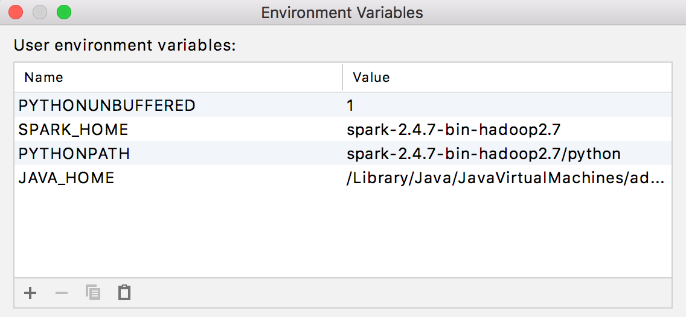
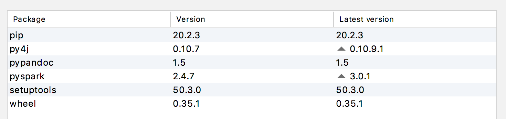
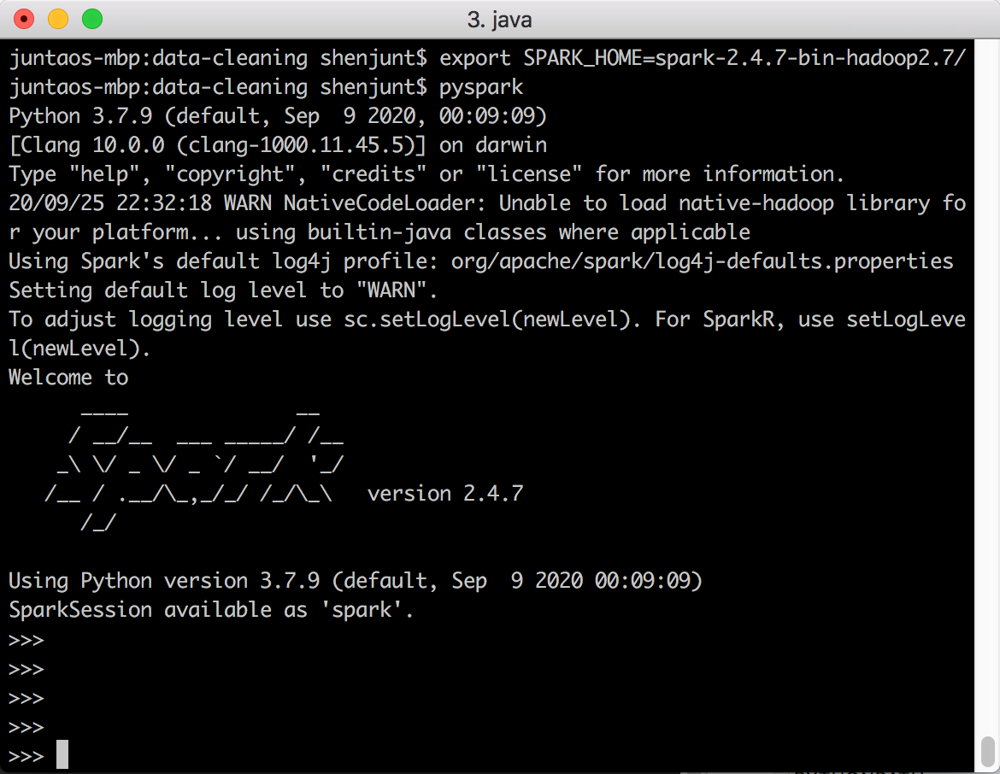

# Data Cleaning

## Q: How do I run the files in Jupyter?
1. You can install Anaconda [here](https://www.anaconda.com/products/individual).
2. You can then install Jupyter though Anaconda.
3. Make sure you have PySpark installed and import the Jupyter notebook. Run the code in localhost.


## Q: How to run the code? (PySpark)
You need to have these packages installed
1. [PySpark Hadoop 2.4.7](https://spark.apache.org/downloads.html).  
2. [Java 1.8 SDK3](https://www.oracle.com/java/technologies/javase/javase-jdk8-downloads.html). You can check your version with ```java -version ```.  
3. Python 3.7 ```Python 3.8``` will not work.   
4. IDE or terminal


## Q: If I am using PyCharm IDE, how do I setup?
You need to setup these following environment variables: ```SPARK_HOME```, ```PYTHONPATH```.   
Here is a screen shot of my setup:

You also need to install pyspark with the version 2.4.7. in the python interpreter.   
Here is a screen shot of my setup:


## Q: If I am using terminal, how do I setup?
You need to setup the ```SPARK_HOME```, ```PYTHONPATH``` and ```PYSPARK_DRIVER_PYTHON```.   
```
export SPARK_HOME=~/spark-2.4.4-bin-hadoop2.7   
```
```
export PYSPARK_PYTHON=python3  
```
```
export PYSPARK_DRIVER_PYTHON=python3  
```   

You can run pyspark and test if it works properly.   
Here is the results if it runs properly:   



## Q: How can I run the program after I setup everything?

First, you need to setup the datasets. Because we **do not have** the ownerships to those data, we cannot share the data here. You can download the data from the website indicated in the README.md. Store the data in the main folder, one level above this folder, and call it datasets. Leave the name of the downloaded file ***unchanged***.

Second, you can run the program with ```python3 general_hospital_cleaning.py ``` on the terminal or run the program in your favourite IDEs. 

***Note you do need to change the input file directory in each data-cleaning script with the directory of your path in your system***

last edited: 2020-11-27